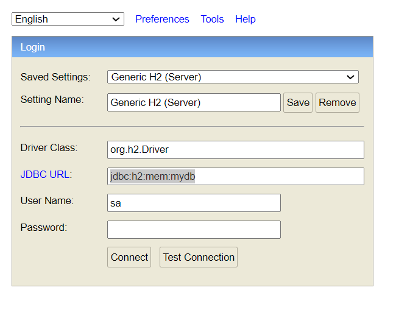
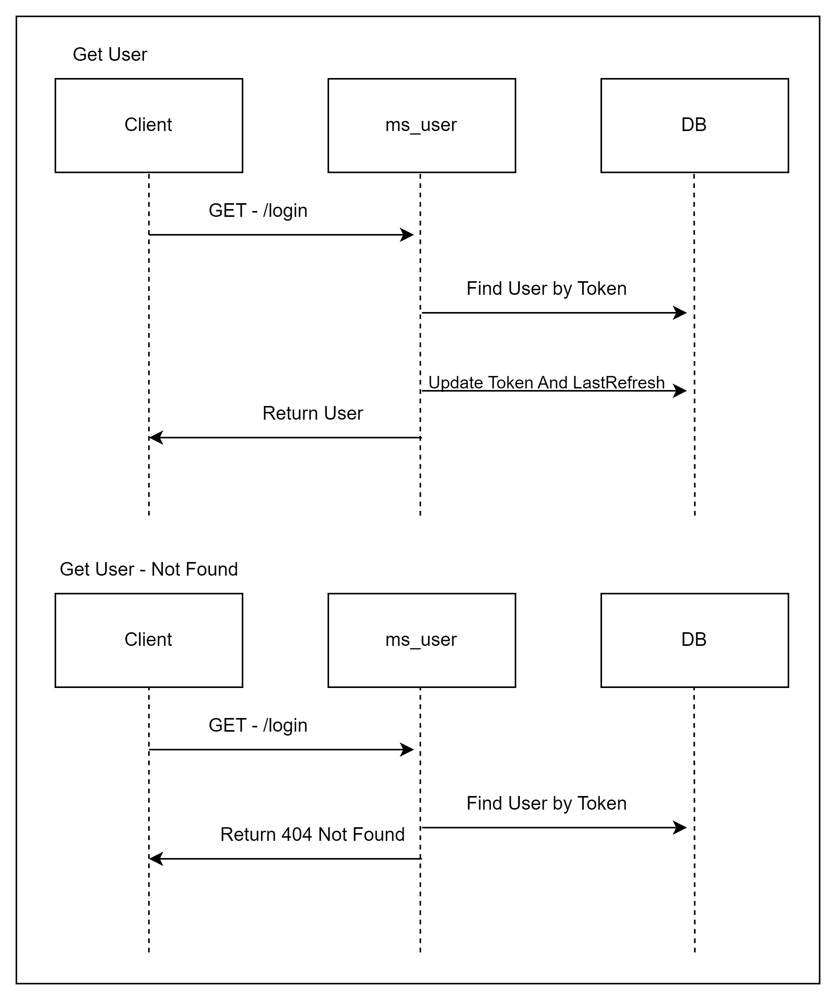
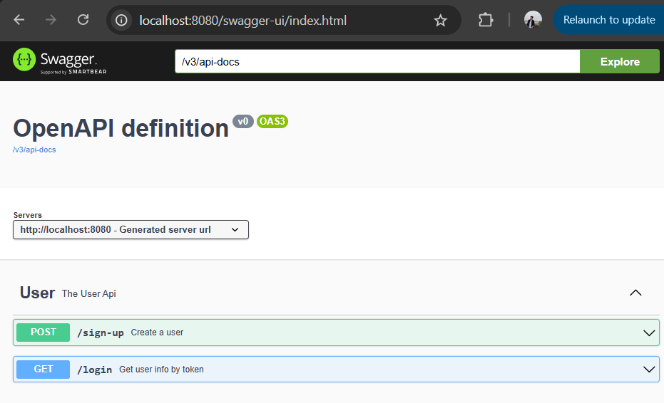

#Ejercicio BCI - Ivan Mariani

El ejercicio cuentas con 2 recursos expuestos llamados

POST - "/sing-up" que permite dar de alta Usuarios en una base de datos en Memoria una H2.

GET - "/login" que permite dconsultar un usuario a traves del Token (en el Header Authorization) que devolvio la llamda anterior

Una vez levanto el Micro servicio, podemos observar la documentación del microservicio, en la siguiente url http://localhost:8080/swagger-ui.html

Para poder ingresar a la base de datos, ir a http://localhost:8080/h2-console y hacer el login en la base en memoria (JDBC URL : jdbc:h2:mem:mydb) con el usuario "sa" y la password "password" img.png Las tablas se crean automáticamente cuando se levanta el microservicio, por la propiedad ddl-auto (que se encuentra en update).No se recomienda usar esta opción en ambientes, solamente para pruebas locales

En el proyecto encontrará también la colección de postman para poder hacer las pruebas necesaria Exercise BCI.postman_collection.json

Comentario: 
La password se encuentra encriptada, la secret key deberia estar cargada en un Secret
Esta solucion de alta de usuario y de login y su manejo de token deberia estar en un "Identity Provider", no en un microservicios