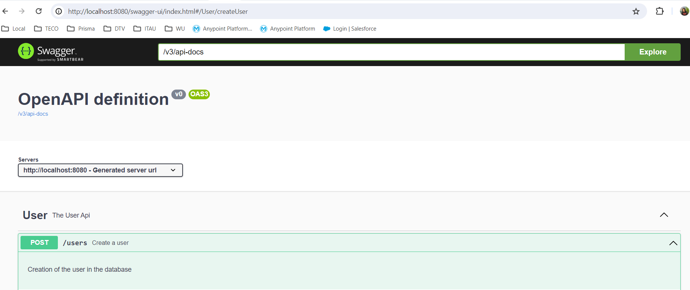

#Ejercicio BCI - Ivan Mariani

El ejercicio cuentas con un recurso expuesto llamado POST - "/users" que permite dar de alta Usuarios en una base de datos en Memoria una H2.

Una vez levanto el Micro servicio, podemos observar la documentación  del microservicio, en la siguiente url _http://localhost:8080/swagger-ui/index.html_ 

Para poder ingresar a la base de datos, ir a _http://localhost:8080/h2-console_ y hacer el login en la base en memoria (JDBC URL : _jdbc:h2:mem:mydb_) con el usuario "sa" y la password "password"

Las tablas se crean automáticamente  cuando se levanta el microservicio, por la propiedad ddl-auto (que se encuentra en update)._No se recomienda usar esta opción  en ambientes, solamente para pruebas locales_ 

En el proyecto encontrará también la colección de postman para poder hacer las pruebas necesaria *Exercise BCI.postman_collection.json*

Diagramas

